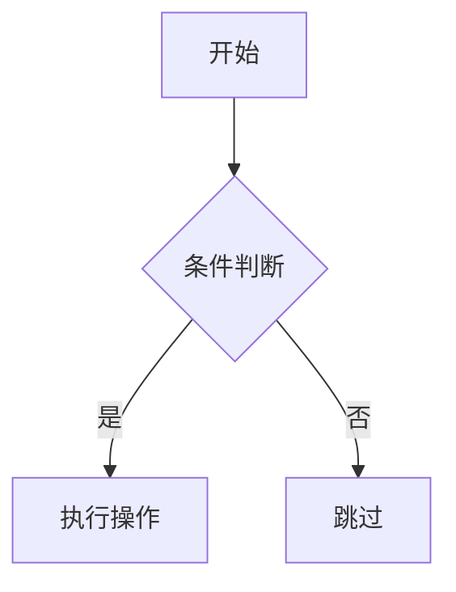
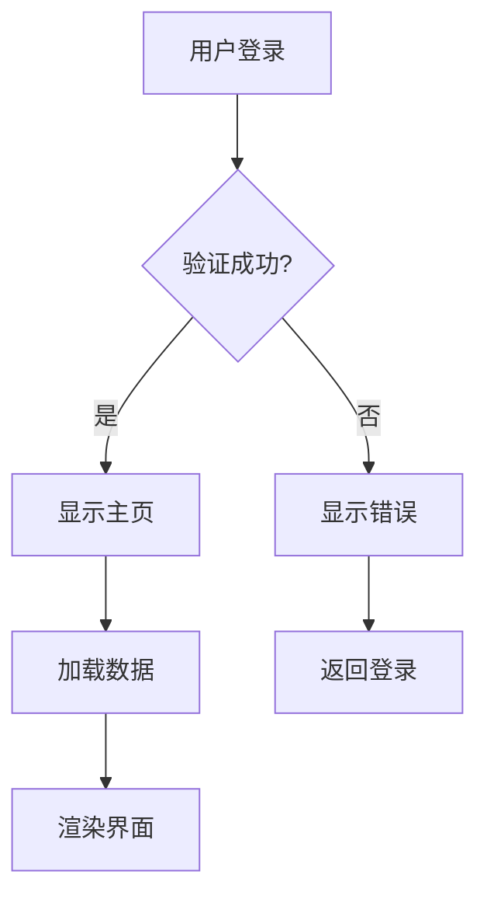
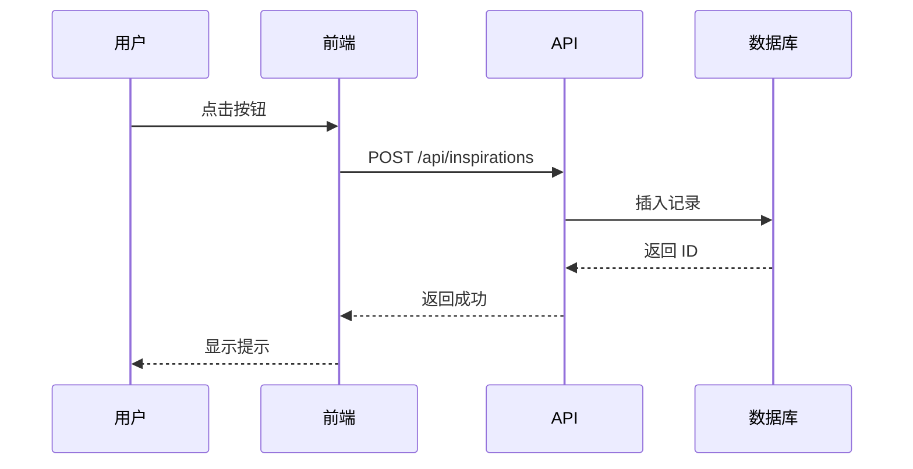
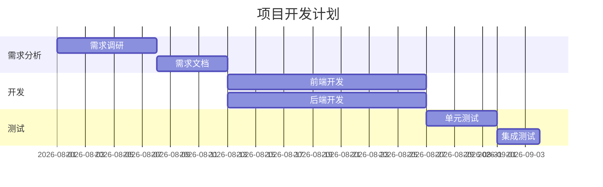
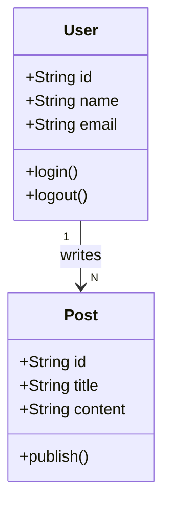
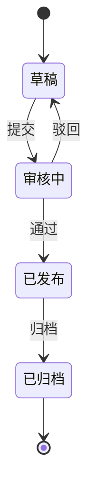
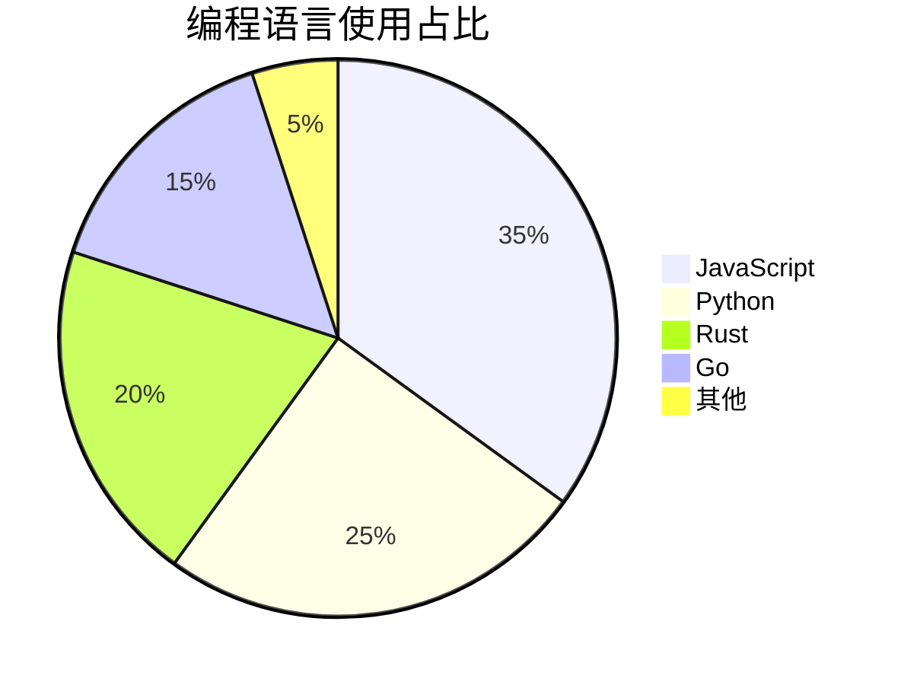
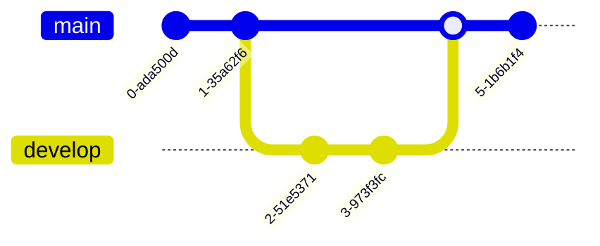
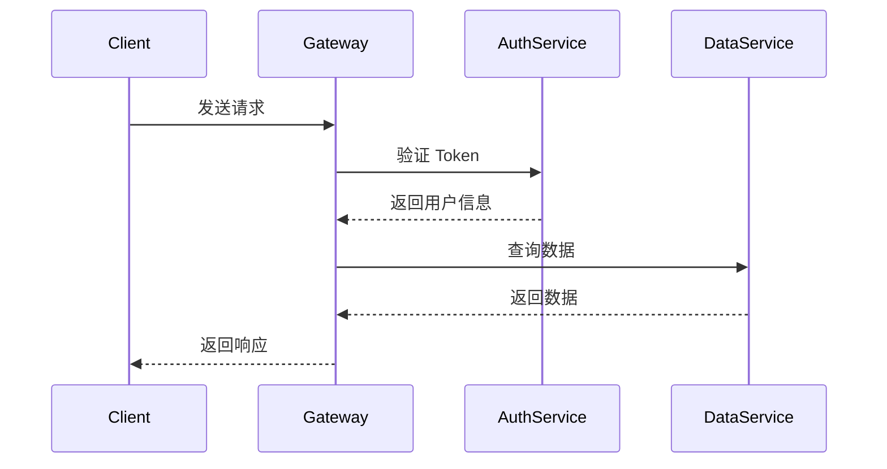
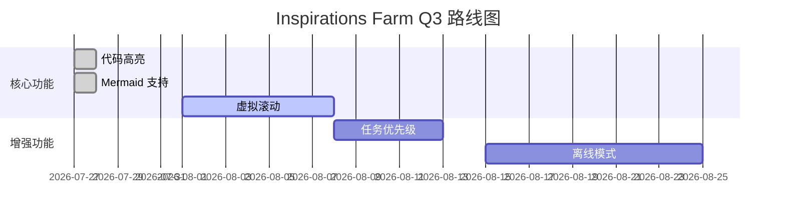

# 代码高亮 + Mermaid 图表使用指南

## 功能概述

Inspirations Farm 现在支持：
- ✅ **代码语法高亮** — 15+ 编程语言自动着色
- ✅ **Mermaid 图表** — 流程图、时序图、甘特图等
- ✅ **暗色模式适配** — 自动切换高亮主题
- ✅ **移动端优化** — 代码块横向滚动

---

## 代码高亮

### 支持的语言

**主流语言**:
- JavaScript / TypeScript
- Python
- Rust
- Go
- Java
- C++

**其他语言**:
- Bash / Shell
- JSON / YAML
- SQL
- CSS / HTML
- Markdown

### 使用方法

在灵感内容中使用三个反引号 + 语言名称：

````markdown
```javascript
function greet(name) {
  console.log(`Hello, ${name}!`);
}

greet('World');
```
````

**效果**: JavaScript 代码会自动高亮，关键字着色

### 示例

#### JavaScript
````markdown
```javascript
const fetchUser = async (id) => {
  const response = await fetch(`/api/users/${id}`);
  return response.json();
};
```
````

#### TypeScript
````markdown
```typescript
interface User {
  id: string;
  name: string;
  email: string;
}

async function getUser(id: string): Promise<User> {
  const res = await fetch(`/api/users/${id}`);
  return res.json();
}
```
````

#### Python
````markdown
```python
def fibonacci(n):
    if n <= 1:
        return n
    return fibonacci(n-1) + fibonacci(n-2)

print(fibonacci(10))
```
````

#### Rust
````markdown
```rust
fn main() {
    let numbers = vec![1, 2, 3, 4, 5];
    let sum: i32 = numbers.iter().sum();
    println!("Sum: {}", sum);
}
```
````

#### Bash
````markdown
```bash
#!/bin/bash
for file in *.txt; do
  echo "Processing $file"
  cat "$file" | wc -l
done
```
````

#### SQL
````markdown
```sql
SELECT u.name, COUNT(p.id) as post_count
FROM users u
LEFT JOIN posts p ON u.id = p.user_id
GROUP BY u.id
HAVING post_count > 10;
```
````

---

## Mermaid 图表

### 支持的图表类型

1. **Flowchart** — 流程图
2. **Sequence** — 时序图
3. **Gantt** — 甘特图
4. **Class** — 类图
5. **State** — 状态图
6. **Pie** — 饼图
7. **Git** — Git 图

### 使用方法

使用三个反引号 + `mermaid`：

````markdown

````

---

## Mermaid 示例

### 1. 流程图 (Flowchart)

````markdown

````

**方向控制**:
- `graph TD` — 从上到下 (Top Down)
- `graph LR` — 从左到右 (Left Right)
- `graph BT` — 从下到上 (Bottom Top)
- `graph RL` — 从右到左 (Right Left)

### 2. 时序图 (Sequence Diagram)

````markdown

````

**箭头类型**:
- `->` — 实线箭头
- `-->` — 虚线箭头
- `->>` — 实线箭头（带箭头）
- `-->>` — 虚线箭头（带箭头）

### 3. 甘特图 (Gantt Chart)

````markdown

````

### 4. 类图 (Class Diagram)

````markdown

````

### 5. 状态图 (State Diagram)

````markdown

````

### 6. 饼图 (Pie Chart)

````markdown

````

### 7. Git 图

````markdown

````

---

## 实际应用场景

### 学习笔记

````markdown
今天学习了 Rust 的所有权系统：

```rust
fn main() {
    let s1 = String::from("hello");
    let s2 = s1; // s1 被移动到 s2
    // println!("{}", s1); // 错误！s1 已失效
    println!("{}", s2); // OK
}
```

**关键概念**:
- 每个值都有一个所有者
- 同一时间只能有一个所有者
- 所有者离开作用域，值被丢弃
````

### 技术方案设计

````markdown
## API 请求流程



**性能优化**:
1. Gateway 缓存用户信息（5 分钟）
2. DataService 使用 Redis 缓存（1 小时）
````

### 项目规划

````markdown
## Q3 开发计划


````

### 算法学习

````markdown
## 二叉树遍历

```python
class TreeNode:
    def __init__(self, val=0, left=None, right=None):
        self.val = val
        self.left = left
        self.right = right

def inorder_traversal(root):
    """中序遍历：左-根-右"""
    if not root:
        return []
    return (inorder_traversal(root.left) + 
            [root.val] + 
            inorder_traversal(root.right))
```

**时间复杂度**: O(n)  
**空间复杂度**: O(n)
````

---

## 样式说明

### 亮色模式
- 主题: GitHub
- 背景: 白色
- 代码: 黑色

### 暗色模式
- 主题: GitHub Dark
- 背景: 深灰色
- 代码: 浅色

### 自定义样式
代码块自动适配 Farm 主题：
- 边框: `var(--farm-line)`
- 背景: `var(--farm-paper)`
- 文字: `var(--farm-ink)`

---

## 常见问题

### Q: 代码块不显示高亮？
A: 确保在三个反引号后指定语言名称，如 ` ```javascript `

### Q: Mermaid 图表不显示？
A: 
1. 检查语法是否正确（访问 [Mermaid 官方文档](https://mermaid.js.org/)）
2. 刷新页面重试
3. 查看浏览器控制台错误信息

### Q: 支持哪些语言别名？
A: 常见别名：
- `js` → `javascript`
- `ts` → `typescript`
- `html` → `xml`

### Q: 代码块太长怎么办？
A: 代码块会自动横向滚动，移动端可以左右滑动

### Q: 如何在 Mermaid 中使用中文？
A: 直接使用中文即可，如示例所示

### Q: Mermaid 图表可以导出吗？
A: 暂不支持，可以截图保存

---

## 性能说明

### 包体积增加
- highlight.js: ~80KB (gzipped, 15 languages)
- Mermaid: ~200KB (gzipped)
- 总增加: ~280KB

### 渲染性能
- 代码高亮: <10ms per block
- Mermaid 图表: ~50-200ms per diagram

### 优化建议
1. 避免单个灵感中使用过多图表（建议 <5 个）
2. 复杂图表分拆为多个小图表
3. 代码块保持在 500 行以内

---

## 更新日志

### 2026-07-27
- ✅ 新增代码高亮支持（15+ 语言）
- ✅ 新增 Mermaid 图表支持（7 种图表类型）
- ✅ 自动适配亮色/暗色模式
- ✅ 移动端优化

---

**立即试用**：在灵感内容中添加代码块或 Mermaid 图表，体验全新的内容表达力！
